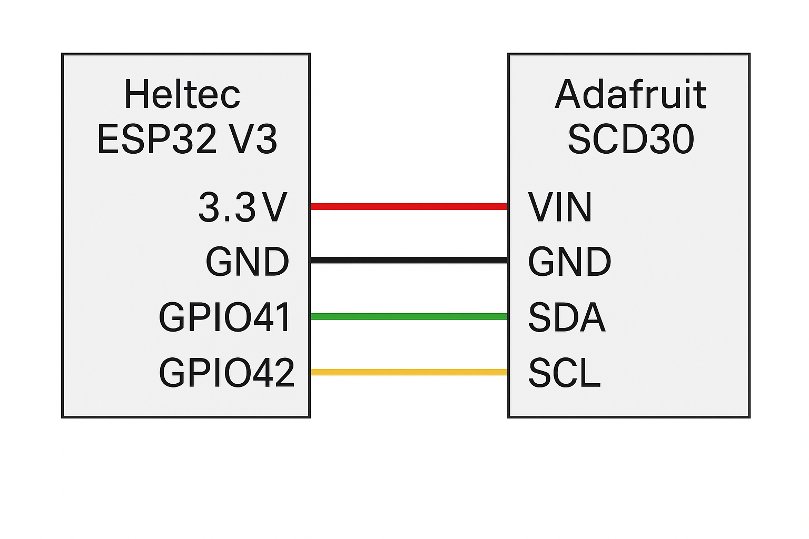

# Smart Ventilation & Air Quality Monitoring System  

## Team Members  
- **Ali Subhan [LinkedIn](https://www.linkedin.com/in/ali5341/)**  
- **Ashir Raza [LinkedIn](https://www.linkedin.com/in/ashir-raza7890/)**

## 1. Project Description

Indoor air quality is directly linked to occupant health, comfort, and productivity. In poorly ventilated environments, elevated carbon dioxide (CO₂) levels and temperature can lead to drowsiness, reduced cognitive function, and general discomfort. This project addresses the need for a smart, automated system that can monitor indoor air quality and proactively control ventilation and cooling mechanisms to maintain a healthy environment.

The core focus of this system is on **CO₂ concentration and ambient temperature**, as these are the most immediate indicators of indoor air quality degradation due to human presence and inadequate ventilation. CO₂ levels above 1000 ppm are known to negatively impact concentration and decision-making, while temperatures exceeding 26°C can cause thermal discomfort. While humidity is measured, it is not currently a primary driver in decision-making logic.

To address these concerns, the system integrates the following features:

- **Accurate Real-Time Monitoring**: Uses the Adafruit SCD30 sensor to measure CO₂, temperature, and humidity with high precision.
- **Predictive Intelligence**: Employs Holt’s double exponential smoothing to forecast CO₂ and temperature trends several minutes ahead, allowing for proactive environmental control.
- **Smart Actuation**: Based on both real-time and forecasted conditions, the system automatically activates ventilation or cooling systems before thresholds are exceeded.
- **Adaptive Deep Sleep**: Implements a dynamic sleep interval based on the rate of change in CO₂, optimizing power efficiency without compromising responsiveness.
- **Cloud Connectivity**: Publishes data to an MQTT broker for real-time monitoring and logs historical data to InfluxDB for long-term analysis and visualization.
- **State Persistence**: Retains key smoothing and control state across deep sleep cycles using ESP32 RTC memory, ensuring continuity and learning over time.

In summary, this system serves as a low-power, intelligent solution for maintaining healthy indoor air quality. It combines environmental sensing, predictive algorithms, and actuator control to create a feedback loop that optimizes air quality while minimizing unnecessary energy usage.

## 2. Hardware Requirements and Setup

This project uses minimal yet powerful hardware to achieve real-time sensing and control with low power consumption.

### 🔧 Hardware Components

| Component       | Description |
|----------------|-------------|
| **Heltec ESP32 V3** | Main microcontroller with built-in Wi-Fi and support for deep sleep; compact, reliable, and power-efficient. |
| **Adafruit SCD30 Sensor** | High-accuracy CO₂, temperature, and humidity sensor with I²C communication; ideal for indoor air quality monitoring. |

### 🔌 Why These Components?

- **Heltec ESP32 V3** supports deep sleep, making it perfect for battery-optimized IoT applications. It also provides built-in USB for programming and debugging.
- **SCD30** provides reliable and precise environmental readings. Its onboard calibration and compensation features improve data quality without extra components.

### 🧰 Wiring Connections

| SCD30 Pin | Heltec ESP32 V3 Pin |
|-----------|---------------------|
| VIN       | 3.3V (or 5V*)        |
| GND       | GND                 |
| SDA       | GPIO 41             |
| SCL       | GPIO 42             |

> ⚠️ *Use 5V if available and compatible; SCD30 works more reliably at 5V even though logic is I²C safe.

### 📷 Hardware Setup Diagram



## 3. System Requirements

This section outlines both the setup dependencies and the implementation-level requirements for the system to function as designed.

---

### 📦 A. System Setup Requirements

#### 🔧 Hardware Components

| Component               | Purpose                                                     |
|------------------------|--------------------------------------------------------------|
| **Heltec ESP32 V3**     | Main microcontroller for computation, sleep, and Wi-Fi       |
| **Adafruit SCD30 Sensor** | Reads CO₂, temperature, and humidity via I²C                 |
| **Connecting Wires**    | Enables I²C communication between ESP32 and SCD30            |
| **Power Supply**        | USB or battery (deep sleep supported for power efficiency)   |
| **Optional Fan/Relay**  | For triggering ventilation or cooling systems                |

#### 💻 Software Dependencies

- Arduino IDE or PlatformIO
- ESP32 Board Support via Espressif package
- Required Arduino libraries:
  - `Adafruit_SCD30`
  - `WiFi.h`
  - `PubSubClient`
  - `InfluxDbClient`, `InfluxDbCloud`
  - `Wire.h`
  - `time.h`

#### 🌐 Cloud & Network Services

- Active Wi-Fi connection for MQTT, NTP, and InfluxDB
- MQTT Broker (e.g., `test.mosquitto.org` or local instance)
- InfluxDB 2.0+ server (cloud or local)

#### 🔐 Required Credentials

To be defined in code or a `config.h` file:
```cpp
#define WIFI_SSID       "YourSSID"
#define WIFI_PASSWORD   "YourPassword"
#define INFLUXDB_URL    "https://your-influxdb-url"
#define INFLUXDB_TOKEN  "your-token"
#define INFLUXDB_ORG    "your-org"
#define INFLUXDB_BUCKET "your-bucket"
#define MQTT_SERVER     "broker.example.com"
#define MQTT_PORT       1883
#define MQTT_TOPIC      "your/topic"
