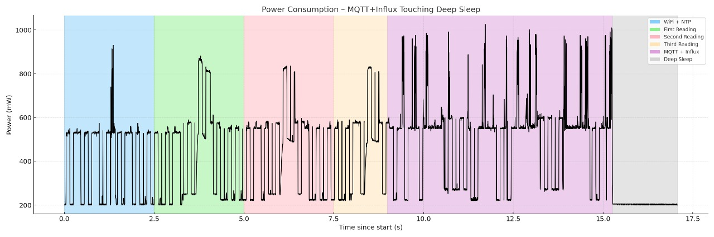

# Smart Ventilation & Air Quality Monitoring System  

## Team Members  
- **Ali Subhan [LinkedIn](https://www.linkedin.com/in/ali5341/)**  
- **Ashir Raza [LinkedIn](https://www.linkedin.com/in/ashir-raza7890/)**

## 1. Project Description

Indoor air quality is directly linked to occupant health, comfort, and productivity. In poorly ventilated environments, elevated carbon dioxide (CO₂) levels and temperature can lead to drowsiness, reduced cognitive function, and general discomfort. This project addresses the need for a smart, automated system that can monitor indoor air quality and proactively control ventilation and cooling mechanisms to maintain a healthy environment.

The core focus of this system is on **CO₂ concentration and ambient temperature**, as these are the most immediate indicators of indoor air quality degradation due to human presence and inadequate ventilation. CO₂ levels above 1000 ppm are known to negatively impact concentration and decision-making, while temperatures exceeding 26°C can cause thermal discomfort. While humidity is measured, it is not currently a primary driver in decision-making logic.

To address these concerns, the system integrates the following features:

- **Accurate Real-Time Monitoring**: Uses the Adafruit SCD30 sensor to measure CO₂, temperature, and humidity with high precision.
- **Predictive Intelligence**: Employs Holt’s double exponential smoothing to forecast CO₂ and temperature trends several minutes ahead, allowing for proactive environmental control.
- **Smart Actuation**: Based on both real-time and forecasted conditions, the system automatically activates ventilation or cooling systems before thresholds are exceeded.
- **Adaptive Deep Sleep**: Implements a dynamic sleep interval based on the rate of change in CO₂, optimizing power efficiency without compromising responsiveness.
- **Cloud Connectivity**: Publishes data to an MQTT broker for real-time monitoring and logs historical data to InfluxDB for long-term analysis and visualization.
- **State Persistence**: Retains key smoothing and control state across deep sleep cycles using ESP32 RTC memory, ensuring continuity and learning over time.

In summary, this system serves as a low-power, intelligent solution for maintaining healthy indoor air quality. It combines environmental sensing, predictive algorithms, and actuator control to create a feedback loop that optimizes air quality while minimizing unnecessary energy usage.

## 2. Hardware Requirements and Setup

This project uses minimal yet powerful hardware to achieve real-time sensing and control with low power consumption.

### 🔧 Hardware Components

| Component       | Description |
|----------------|-------------|
| **Heltec ESP32 V3** | Main microcontroller with built-in Wi-Fi and support for deep sleep; compact, reliable, and power-efficient. |
| **Adafruit SCD30 Sensor** | High-accuracy CO₂, temperature, and humidity sensor with I²C communication; ideal for indoor air quality monitoring. |

### 🔌 Why These Components?

- **Heltec ESP32 V3** supports deep sleep, making it perfect for battery-optimized IoT applications. It also provides built-in USB for programming and debugging.
- **SCD30** provides reliable and precise environmental readings. Its onboard calibration and compensation features improve data quality without extra components.

### 🧰 Wiring Connections

| SCD30 Pin | Heltec ESP32 V3 Pin |
|-----------|---------------------|
| VIN       | 3.3V (or 5V*)        |
| GND       | GND                 |
| SDA       | GPIO 41             |
| SCL       | GPIO 42             |

> ⚠️ *Use 5V if available and compatible; SCD30 works more reliably at 5V even though logic is I²C safe.

### 📷 Hardware Setup Diagram


## 3. System Requirements

This section outlines both the setup dependencies and the implementation-level requirements for the system to function as designed.

#### 🔧 Hardware Components

| Component               | Purpose                                                     |
|------------------------|--------------------------------------------------------------|
| **Heltec ESP32 V3**     | Main microcontroller for computation, sleep, and Wi-Fi       |
| **Adafruit SCD30 Sensor** | Reads CO₂, temperature, and humidity via I²C                 |
| **Connecting Wires**    | Enables I²C communication between ESP32 and SCD30            |
| **Power Supply**        | USB or battery (deep sleep supported for power efficiency)   |
| **Optional Fan/Relay**  | For triggering ventilation or cooling systems                |

#### 💻 Software Dependencies

- Arduino IDE or PlatformIO
- ESP32 Board Support via Espressif package
- Required Arduino libraries:
  - `Adafruit_SCD30`
  - `WiFi.h`
  - `PubSubClient`
  - `InfluxDbClient`, `InfluxDbCloud`
  - `Wire.h`
  - `time.h`

#### 🌐 Cloud & Network Services

- Active Wi-Fi connection for MQTT, NTP, and InfluxDB
- MQTT Broker (e.g., `test.mosquitto.org` or local instance)
- InfluxDB 2.0+ server (cloud or local)

#### 🔐 Required Credentials

To be defined in code or a `config.h` file:
```cpp
#define WIFI_SSID       "YourSSID"
#define WIFI_PASSWORD   "YourPassword"
#define INFLUXDB_URL    "https://your-influxdb-url"
#define INFLUXDB_TOKEN  "your-token"
#define INFLUXDB_ORG    "your-org"
#define INFLUXDB_BUCKET "your-bucket"
#define MQTT_SERVER     "broker.example.com"
#define MQTT_PORT       1883
#define MQTT_TOPIC      "your/topic"
```

## 4. Functional Requirements

This system is designed to intelligently monitor and respond to indoor air quality by combining real-time sensing, forecasting, and adaptive control logic. The following functional requirements define the core behaviors of the system:

| Requirement                        | Description |
|-----------------------------------|-------------|
| **Environmental Sensing**         | Measure CO₂ (ppm), temperature (°C), and humidity (%) using the Adafruit SCD30 sensor. |
| **Sensor Stabilization**          | Use a dual-read method to discard the first (often unstable) reading after each wake cycle. |
| **Occupancy Detection**           | Determine if the room is empty by checking if CO₂ is below a 500 ppm threshold, and enter longer sleep to conserve energy. |
| **Time Synchronization**          | Perform one-time NTP sync on first boot to ensure accurate epoch time for trend calculations. |
| **State Persistence**             | Store CO₂, temperature, and trend data in RTC memory to retain forecasting context across deep sleep cycles. |
| **Slope Estimation**              | Calculate the rate of change of CO₂ and temperature (in ppm/min and °C/min) based on time difference between wake cycles. |
| **Forecasting**                   | Use Holt’s double exponential smoothing to predict CO₂ and temperature values a few minutes into the future. |
| **Ventilation & Cooling Control** | Decide whether to turn on ventilation or cooling based on real-time and forecasted air quality. |
| **MQTT Publishing**               | Publish sensor readings and actuator events to a configurable MQTT topic for live monitoring. |
| **InfluxDB Logging**              | Log all readings, slopes, and actuator states to an InfluxDB 2.x instance for long-term analysis and visualization. |
| **Adaptive Sleep Duration**       | Dynamically adjust deep sleep interval based on CO₂ slope and a predefined drift tolerance to balance accuracy with energy savings. |
| **Fallback Handling**             | Enter a safe default sleep mode when sensor readings fail or valid time isn't available to avoid system crash. |

## 5. How the Code Works

This system follows a structured and power-efficient duty cycle that repeats every time the ESP32 wakes up from deep sleep. The primary purpose is to measure indoor air quality, predict future conditions, and determine whether to simulate actuation (ventilation or cooling) based on those predictions. No physical actuators are connected — all control decisions are logged and published for analysis.

### 🕓 Duty Cycle Overview

Each wake cycle performs the following steps:

1. **Startup & Power Optimization**
   - Serial is initialized for logging.
   - CPU frequency is lowered and Bluetooth is disabled to save power.

2. **Network Connection**
   - Connects to Wi-Fi and MQTT broker.
   - On first boot only, performs an NTP time sync to establish valid system time.

3. **Sensor Reading (SCD30)**
   - The SCD30 sensor is initialized.
   - A **dual-read technique** is used: the first valid reading is discarded, and the second is accepted to ensure stability.
   - CO₂, temperature, and humidity values are stored.

4. **Empty Room Detection**
   - If CO₂ < 500 ppm, the room is assumed to be unoccupied.
   - The system enters a long deep sleep (e.g., 20 minutes) to conserve power.

5. **Time & Trend Calculation**
   - The current time is compared with the last recorded time to compute `Δt` (minutes since last wake).
   - Using the current and last CO₂/temperature values, the system calculates slopes (rate of change per minute).

6. **Holt’s Forecasting**
   - Applies Holt’s double exponential smoothing to update internal level and trend estimates for both CO₂ and temperature.
   - Predicts values `2 minutes` into the future.

7. **Decision Logic (Virtual Actuation)**
   - Based on forecasted values:
     - If predicted CO₂ ≥ 1000 ppm → simulate turning **fan ON**
     - If predicted temperature ≥ 26°C → simulate turning **cooling ON**
   - These actions are **not physically executed** but are tracked in flags and published for observation.

8. **Data Publishing**
   - A structured payload is published over MQTT, containing:
     - Current readings
     - Slopes
     - Forecasts
     - Simulated fan/cooling actions
   - The same data is also logged to InfluxDB for visualization and analysis.

9. **Dynamic Deep Sleep Calculation**
   - Using a user-defined `DRIFT_PPM` value (e.g., 50 ppm), the system calculates how long it can sleep before a significant change in CO₂ might occur.
   - Sleep duration is bounded between 30 seconds and 15 minutes.

10. **State Persistence**
    - All relevant state variables (last readings, smoothing parameters, time) are stored in RTC memory to persist across sleep cycles.

11. **Deep Sleep**
    - The ESP32 enters deep sleep for the computed duration, cutting power usage to minimal levels.

---

### 🧪 Simulation Mode

- No fans or cooling systems are physically connected.
- Actuator decisions are **logged and published** purely for visualization or future expansion.
- Ideal for testing forecasting logic and system behavior in a virtualized or lab environment.

---

This approach allows the system to operate autonomously, forecast intelligently, and publish meaningful insights with minimal power consumption — ready for real-world deployment with actuators when needed.

## 6. Classroom Testing

To validate system performance in a real-world scenario, we deployed the ESP32 monitor in a classroom and collected CO₂ (ppm) and temperature (°C) readings over a school day. The graph below shows how concentrations and ambient temperature evolved, with class periods (12:00–14:00 and 15:00–17:00) shaded in gray.


**Observations:**
- **Morning (11:00–12:00):** CO₂ remains low (~580–630 ppm) before students arrive; temperature gradually rises from ~27.5 °C to ~28.5 °C.
- **First Class (12:00–14:00):** CO₂ spikes above 1200 ppm, indicating high occupancy and limited ventilation; temperature continues rising up to ~30 °C.
- **Break (14:00–15:00):** CO₂ drops back towards ~630 ppm as students leave; temperature peaks around 30.2 °C then stabilizes.
- **Second Class (15:00–17:00):** CO₂ again climbs above 1100 ppm; temperature slowly declines from ~30.5 °C to ~28.5 °C, reflecting HVAC or window adjustments.
- **End of Day (17:00–18:00):** CO₂ and temperature both decrease towards baseline.

This test demonstrates the system’s ability to track rapid changes in air quality during occupied periods, providing both real-time data and context for proactive ventilation control.

## 7. Pre-emptive Actuator Control

One of the core features of this system is its ability to perform **pre-emptive actuation** — deciding whether to turn on ventilation or cooling *before* air quality becomes uncomfortable. This is accomplished by predicting CO₂ and temperature levels 2 minutes into the future using **Holt’s double exponential smoothing**, rather than waiting for thresholds to be crossed in real time.

Although **no physical fan or AC unit is connected** in this prototype, the system simulates actuator decisions based on forecasted values, and logs those decisions for analysis or future integration.

### 🔍 How It Works

1. **Forecasting CO₂ and Temperature**
   - After each sensor reading, the system applies Holt's smoothing to estimate:
     - `L` (level): smoothed current value
     - `T` (trend): estimated rate of change per minute
   - It then predicts the values `LOOKAHEAD_MIN` (e.g. 2 minutes) into the future:
     ```cpp
     co2_pred  = L_co2 + T_co2 * LOOKAHEAD_MIN;
     temp_pred = L_temp + T_temp * LOOKAHEAD_MIN;
     ```

2. **Defining Pre-emptive Triggers**
   - If the **forecasted** CO₂ is ≥ 1000 ppm → preemptively ventilate
   - If the **forecasted** temperature is ≥ 26 °C → preemptively cool
   - These are captured as Boolean flags:
     ```cpp
     bool preemptVent = (co2_pred >= 1000.0f);
     bool preemptCool = (temp_pred >= 26.0f);
     ```

3. **Decision Logic with State Tracking**
   - The system keeps track of whether the fan or cooler **was ON** in the last cycle using `RTC_DATA_ATTR` variables (which persist across deep sleep).
   - Based on preemptive triggers and real-time values, it determines:
     - Whether to **turn ON**, **turn OFF**, or make **no change**
   - Example:
     ```cpp
     if (preemptVent || co2_i > 1000.0f) fanNow = true;
     if (fanNow && !fanWasOn) fanAct = "TURNED_ON";
     else if (!fanNow && fanWasOn) fanAct = "TURNED_OFF";
     ```

4. **Simulation & Publishing**
   - Since this project does not connect physical actuators, the decisions are:
     - Published as part of an MQTT JSON payload
     - Logged to InfluxDB for later review
   - Example MQTT payload:
     ```json
     {
       "co2": 1120.5,
       "temp": 28.4,
       "fan": "TURNED_ON",
       "cooling": "NO_CHANGE",
       "preemptVent": true,
       "preemptCool": false
     }
     ```

### ✅ Why Pre-emptive Control?

- **Foresight Over Reaction**: By acting before thresholds are reached, the system avoids unnecessary discomfort or health risks.
- **Power Efficiency**: Relays or fans can run for shorter periods by starting just in time rather than running late and longer.
- **Scalability**: The same logic can be extended to real-world hardware with minimal changes — just assign `fanNow` and `coolingNow` to GPIO pins.

---

This predictive control architecture makes the system not only reactive to poor conditions, but also **proactively intelligent** — a crucial requirement for smart building systems or energy-aware classrooms.


With this in place, your ESP32 only wakes as often as needed to maintain air quality—maximizing battery life without sacrificing comfort.


## 8. Dynamic Deep Sleep Cycle

This project uses a **dynamic deep sleep strategy** to optimize power consumption while maintaining responsive air quality monitoring.

### How It Works

After each sensor read & control decision, the ESP32 calculates how long it can safely sleep before the next reading is needed.

#### Adaptive Sleep Based on CO₂ Trend

The sleep interval is **adaptively adjusted** based on the current CO₂ trend:

`next_sleep = DRIFT_PPM / ( |dCO₂/dt| + EPSILON )`

#### Parameters

- **DRIFT_PPM** = 50 ppm → allowed CO₂ change before next wake
- **dCO₂/dt** → estimated CO₂ slope (ppm/min) computed via Holt’s smoothing
- **EPSILON** → small constant to prevent division by zero

#### Sleep Constraints

The computed sleep time is clipped between:

- **MIN_SLEEP_MIN** = 0.5 min → 30 s minimum sleep
- **MAX_SLEEP_MIN** = 15 min → maximum sleep cap

#### Behavior

- If the room is **empty** (CO₂ < 500 ppm), a fixed sleep of 20 min is used.
- On first boot (no prior state), sleep defaults to 1 min.
- If the sensor read fails, a fallback sleep of 120 s is used.

---

This mechanism allows the ESP32 to behave like an **event-driven smart sensor**, balancing accuracy and energy efficiency.


### Special Cases

- If the **room is empty** (CO₂ < 500 ppm), a longer idle sleep of 20 min is used to conserve energy.
- If the sensor fails to produce a valid reading, a fallback sleep of 120 s is triggered.
- On the **first boot**, sleep defaults to 1 min.

### Benefits

✅ **Power efficiency**: sleep time increases automatically when air quality is stable  
✅ **Responsiveness**: wake-up rate increases automatically when CO₂ trends rise  
✅ **Long battery life** in unattended deployments  
✅ Fully **adaptive without manual tuning** → Holt’s smoothing handles noisy sensor data and gradual changes

### Example Behavior

| CO₂ slope (ppm/min) | Next sleep interval |
|---------------------|--------------------|
| 0.0                 | 15 min (MAX_SLEEP) |
| 1.0                 | 50 / 1 = 50 min → clipped to 15 min |
| 5.0                 | 50 / 5 = 10 min    |
| 10.0                | 50 / 10 = 5 min    |
| 50.0                | 50 / 50 = 1 min    |
| Very high (>100)    | 0.5 min (MIN_SLEEP) |

---

This **self-adjusting deep sleep** allows the ESP32 to act like a **smart, event-driven sensor** — only waking more often when needed, and conserving energy when the environment is stable.

## 9. Power Consumption Analysis

The system’s power consumption was measured using an **INA219 current sensor** connected to a second ESP32, recording the current draw during a full operating cycle. The following plot shows the result:



### Phase-by-Phase Explanation

The graph shows the **power profile of one complete cycle**, from wake to deep sleep. The phases are color-coded and labeled:

### 🟦 1. WiFi + NTP (0–2.5 s)

- **Initial wake from deep sleep** → ESP32 starts at reduced CPU clock (80 MHz).
- **WiFi STA starts** → initial power ~400–500 mW.
- **WiFi association + DHCP** causes the first large spikes → up to **~1000 mW**.
- **NTP sync** is performed on first boot → adds further spikes (~1–2 s window).
- Once WiFi connects and NTP is done → power settles ~500–600 mW.

### 🟩 2. First Reading (2.5–5 s)

- **SCD30 sensor started** → I²C active.
- The ESP32 **polls dataReady()** and triggers the first read.
- First valid reading is **discarded** (sensor warming phase).
- Peaks ~800–900 mW occur during sensor read and I²C traffic.
- Slight oscillations visible → waiting for stable first read.

### 🟥 3. Second Reading (5–7.5 s)

- Second polling phase → this time, the reading is **accepted**.
- Power pattern similar to first read but more stable.
- Peaks ~800–900 mW again during I²C read.
- This phase ensures valid CO₂, temp, and humidity values.

### 🟧 4. Third Reading (7.5–10 s)

- Optional third reading → for confirmation or retries.
- Similar behavior to second read → ~400–900 mW.
- This phase ensures the **data fed to Holt’s smoothing** is stable.

### 🟪 5. MQTT + Influx (10–15 s)

- **WiFi remains ON** during this phase → baseline ~500 mW.
- **MQTT.connect()** → brief spike when broker connection established.
- **MQTT.publish()** → lightweight → ~600–700 mW peak.
- **Influx.writePoint()** → dominant contributor:
  - TLS handshake → multiple sharp peaks.
  - HTTPS POST → ~1000 mW spikes.
  - Influx write takes **~3–5 seconds** due to:
    - TLS connection setup (cold start every cycle).
    - HTTPS POST and response wait.
- Dense repeated peaks here correspond to:
  - TCP retransmissions
  - TLS fragment exchange
  - Certificate validation

### ⬛ 6. Deep Sleep (>15 s)

- After Influx write → ESP32 calls `esp_deep_sleep()`.
- Power drops sharply → baseline ~200 mW (depends on board leakage + INA219 offset).
- Very flat line indicates **successful deep sleep**:
  - WiFi off
  - SCD30 off
  - CPU halted
  - Only RTC domain running

---

### Observed Trends and Insights

- **Most power is spent in the purple region (MQTT + Influx)**:
  - InfluxDB write dominates time and power → due to full TLS handshake on each wake.
  - If Influx used persistent connection → write time would drop < 1 s.
- **Sensor reading is relatively efficient** (~3–5 s window).
- **WiFi association + NTP is variable** → largest spikes happen here.
- **Deep sleep is very clean** → ~200 mW baseline confirms successful optimization:
  - `setCpuFrequencyMhz(80)`
  - `btStop()`
  - Proper sleep entry.

### Summary Table

| Phase                | Time Range (s) | Typical Power (mW) | Comments                            |
|----------------------|----------------|-------------------|-------------------------------------|
| WiFi + NTP           | 0–2.5          | 400–1000          | WiFi connect, NTP sync               |
| First Reading        | 2.5–5          | 400–900           | SCD30 I²C polling, first read        |
| Second Reading       | 5–7.5          | 400–900           | SCD30 valid read                     |
| Third Reading        | 7.5–10         | 400–900           | Optional third read / retries        |
| MQTT + Influx        | 10–15          | 500–1000          | MQTT fast, Influx TLS is heavy phase |
| Deep Sleep           | >15            | ~200              | Very low-power idle                  |

---

### Final Notes

- The system demonstrates an **event-driven power profile** with adaptive deep sleep.
- The largest optimization opportunity is in the **InfluxDB write phase**:
  - Possible approaches:
    - Use Influx batch writes → less TLS overhead.
    - Skip Influx on low-priority cycles.
    - Use UDP if reliability can be traded for speed.
- Overall → the ESP32 performs very well and the deep sleep cycle behaves exactly as designed.

---

👉 This graph validates the system's **power efficiency design** and shows that the dynamic deep sleep logic allows the ESP32 to operate in a very **energy-conscious** manner while maintaining accurate air quality reporting.


